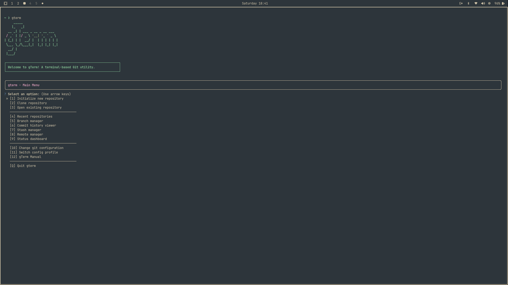
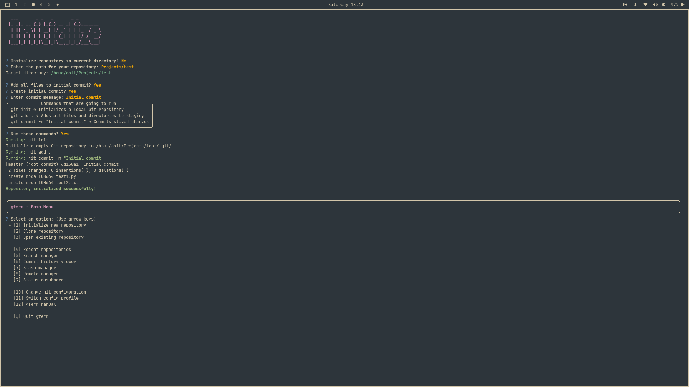
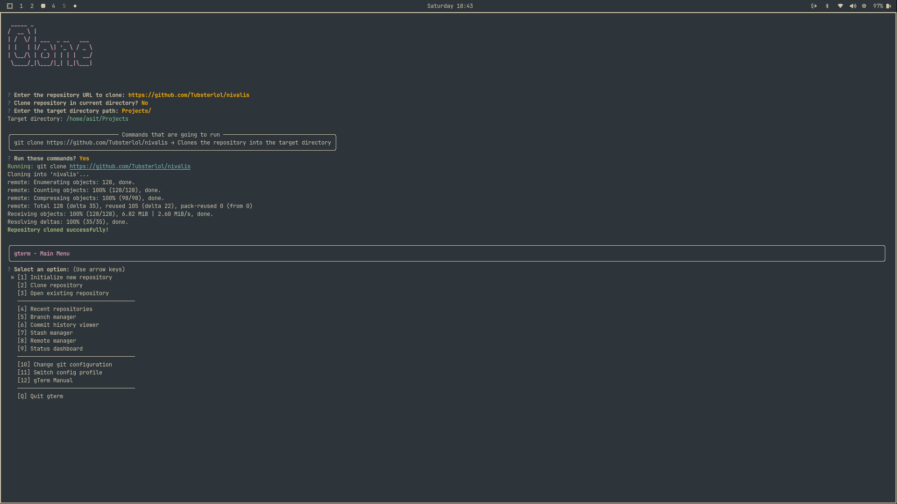
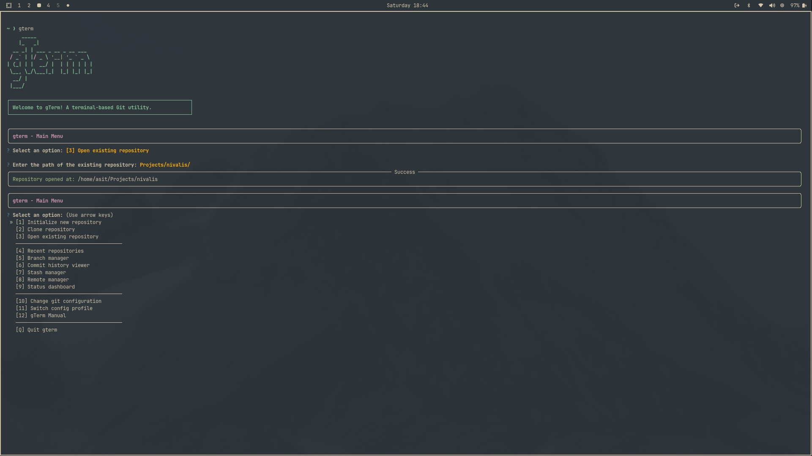
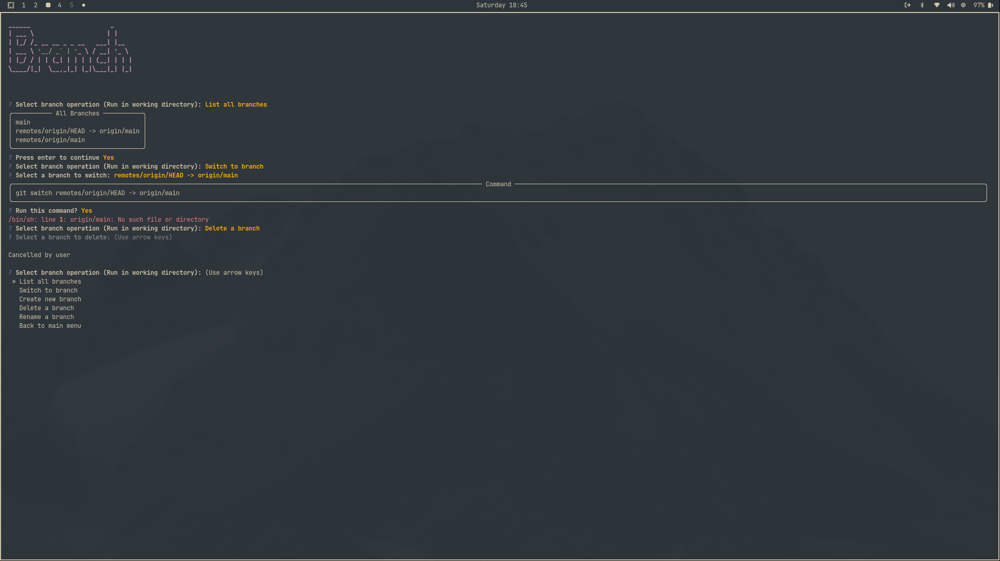

<div align="center">

<pre>
     _____                   
    |_   _|                  
  __ _| | ___ _ __ _ __ ___  
 / _` | |/ _ \ '__| '_ ` _ \ 
| (_| | |  __/ |  | | | | | |
 \__, \_/\___|_|  |_| |_| |_|
  __/ |                      
 |___/                       

┌─────────────────────────────────────────────────────────────┐
│                 A terminal-based Git utility.               │
└─────────────────────────────────────────────────────────────┘
</pre>
</div>


# • gTerm — A Command-Line Git Assistant

**gTerm** is a **terminal-based tool** that makes working with Git easier and more intuitive.
It offers a clean, menu-driven interface to help you manage everyday Git tasks — like **committing changes, switching branches, and cloning repositories** — without needing to remember complex commands.

Whether you're a beginner or a seasoned developer, gTerm keeps your workflow fast, safe, and efficient — all from the comfort of your terminal.
And whether you're on Linux or Windows, gTerm works anywhere.

---

## • Why I’m Building This

I wanted a **fast, minimal Git assistant** that feels like a native part of the terminal —  
something that doesn’t rely on bloated GUIs, but also avoids typing repetitive Git commands manually.

This project is about striking a balance:  
a tool that helps **learn Git concepts** while still being practical enough to use every day.  
It’s open-source, transparent, and portable — so anyone can tweak it, improve it, or just use it to save time.

---

## • How It’s Made

- **Language:** Python 3  
- **Libraries:**  
  - [`rich`](https://pypi.org/project/rich/) — for console output  
  - [`questionary`](https://pypi.org/project/questionary/) — for interactive prompts  
- **Structure:**  
  Each Git operation is modular — `clone_repo.py`, `branch_manager.py`, `init_repo.py`, etc.  
  This makes it easy to extend or maintain the tool.  
- **OS Support:** Works on **Linux** and **Windows (PowerShell)**.

---

## • Features

- Initialize or clone repositories easily  
- Open and inspect existing repos  
- Manage branches (create, switch, delete, list)  
- Commit changes to existing repositories  
- Stash and restore work  
- Change Git configuration or switch profiles  
- Clean terminal after every action for a smooth TUI experience  
- Built-in help manual for quick command reference  

---

## • Installation

<details>
<summary>🐧 Linux </summary>

### Prerequisites
Make sure you have **Python 3.9+** and **Git** installed:

```bash
sudo apt update
sudo apt install python3 python3-pip git -y
```
### Clone the repository
```bash
git clone https://github.com/Tubsterlol/gTerm.git
cd gTerm
```

### Install Python Dependencies
```bash
pip install -r requirements.txt
```

### Make gTerm globally accessible
```bash 
pip install --user -e .
gterm
```
</details>

<details>
<summary>🪟 Windows Installation (PowerShell)</summary>

# Prerequisites
Make sure you have **Python 3.9+** and **Git** installed:

```powershell
sudo apt update
sudo apt install python3 python3-pip git -y
```

### Clone the repository
```powershell
git clone https://github.com/Tubsterlol/gTerm.git
cd gTerm
```

### Install Dependencies
```powershell
pip install -r requirements.txt
```

### Install gTerm
```powershell
pip install --user -e .
```
### Run gTerm
```powershell
gterm
```

### Optional: Add gTerm to PATH(if command not found)
<ol>
<li>Open System Properties → Environment Variables</li>
<li>Under User variables, edit the Path variable</li>
<li>Add this (replace username):</li>
C:\Users\<username>\AppData\Roaming\Python\Python311\Scripts
<li>Open a new Powershell window and try again</li>
</ol>
</details>

---

## • Using gTerm

Just type "**gterm**" in your terminal to run.

Once running, **gTerm** provides a simple, menu-driven interface for all major Git operations:

### • Main Menu Options

- **Initialize New Repository** — Create a fresh Git repository in a selected directory.  
- **Clone Repository** — Clone any remote repository using its URL.  
- **Open Existing Repository** — Work inside an existing local repository.  
- **Recent Repositories** — Quickly access your recently used repositories.
- **Branch Manager** — Create, switch, delete, or list branches.  
- **Commit History Viewer** — Browse and inspect previous commits.**(WIP)**
- **Stash Manager** — Save your current work or restore stashed changes.**(WIP)**
- **Remote Manager** — Add, remove, or view remote repositories.**(WIP)**
- **Status Dashboard** — View the current repository status at a glance.**(WIP)**  
- **Change Git Configuration** — Update your global `user.name` or `user.email`.**(WIP)**  
- **Switch Config Profile** — Toggle between different Git configuration profiles.**(WIP)**
- **gTerm Manual** — View this in-terminal help and reference menu.

Each option is interactive — you’ll be prompted for confirmation before any Git command runs, ensuring a safe and transparent workflow.

---
<details>
  <summary><strong>• Previews</strong></summary>

  
  
  
  
  

</details>
